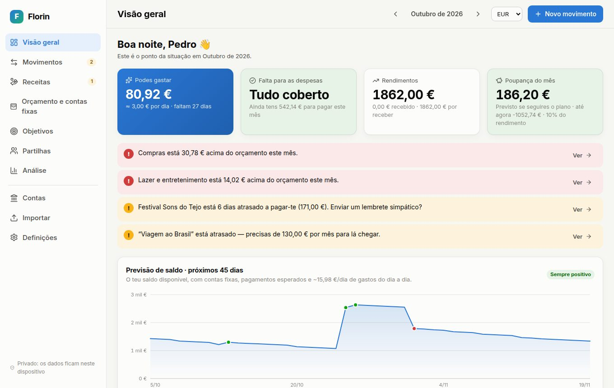
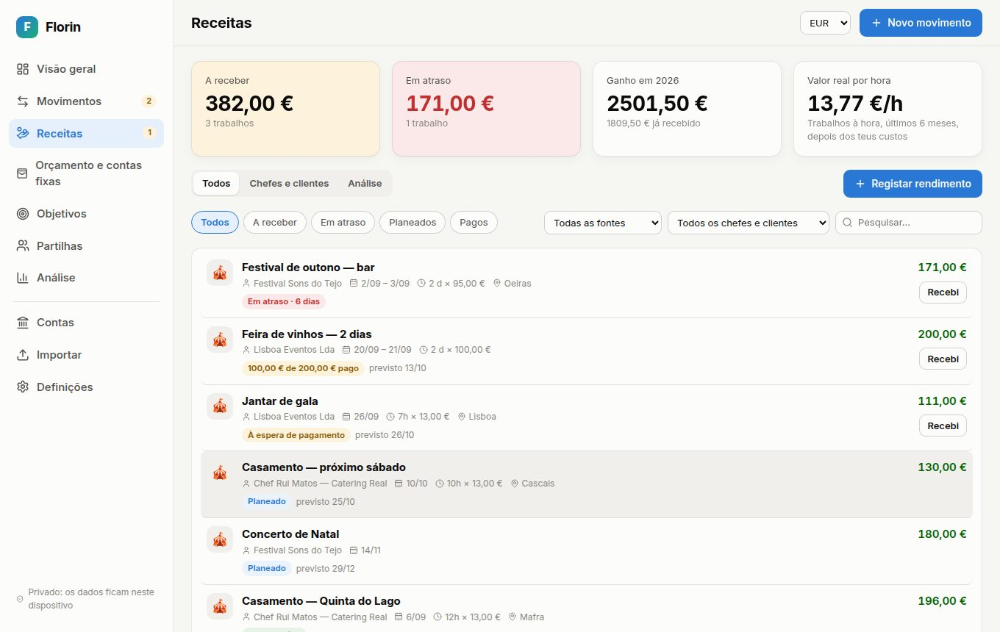
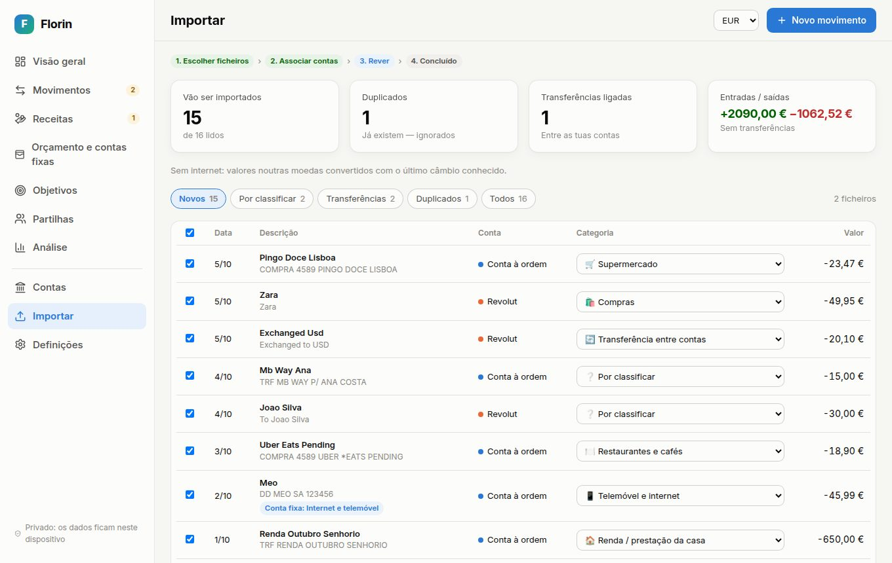
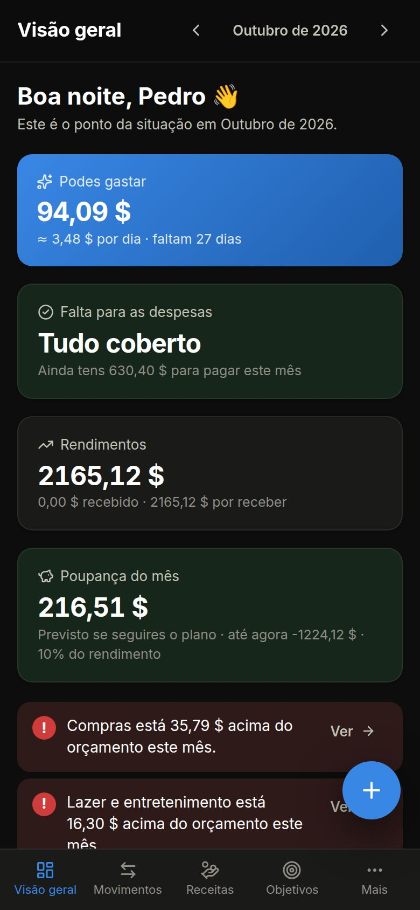

# Florin — finanças pessoais

**Florin** é uma aplicação web de finanças pessoais que responde às perguntas que importam:

- **Quanto posso gastar este mês?** E quanto por dia até ao fim do mês.
- **Quanto me falta para pagar as despesas?**
- **Quando vou receber?** Quem me deve, quem está atrasado e quanto ganho realmente por hora.
- **Vou ficar sem dinheiro?** Previsão do saldo dia a dia para os próximos 45 dias.
- **Como chego aos meus objetivos?** Quanto pôr de lado por mês e onde cortar.

Funciona em português e inglês, em computador e telemóvel (pode ser instalada como app). É **privada por natureza**: não tem servidor nem contas de utilizador, e os dados ficam no dispositivo de cada pessoa.



> O nome “Florin” é provisório. Para mudar a marca, edita `src/config.ts` (nome e versão), `index.html`, `public/manifest.webmanifest` e o ícone `public/icon.svg`.

---

## Funcionalidades

### Painel (Visão geral)
- **Podes gastar**: rendimento − despesas fixas − essenciais − meta de poupança − o que já gastaste em estilo de vida. Também fica limitado pelo dinheiro que tens de facto nas contas.
- **Falta para as despesas**: o valor exato que te falta, se faltar, para pagar o que ainda está pendente no mês.
- **Previsão de saldo a 45 dias**, com as contas fixas, os pagamentos esperados e a média de gastos do dia a dia. Avisa antes de o saldo ficar negativo.
- **Avisos inteligentes**: orçamentos ultrapassados (ou a caminho disso), pagamentos em atraso, gastos acima da média, subscrições esquecidas, objetivos atrasados, quem demora mais a pagar.
- **A seguir**: contas e recebimentos das próximas 3 semanas, com o botão “Paguei”.

### Receitas detalhadas


- **Fonte do dinheiro**: evento/biscate, salário, freelance, gorjetas, presente, venda, investimento, arrendamento, reembolso, apoio ou outro.
- **Quem paga** (chefe, cliente, agência ou familiar), o evento, o local, a data ou datas de trabalho e o horário (ex.: 18:00–02:30 dá 8,5 h).
- **À hora, ao dia ou valor fixo**, mais gorjetas e bónus, descontos (retenção na fonte, comissões) e os teus custos (transporte, farda). Calcula o **lucro real** e o **valor real por hora**.
- **Data prevista de pagamento**, automática a partir do prazo habitual de cada chefe ou cliente. Estados: planeado, à espera, **em atraso há N dias**, pago em parte, pago (e quantos dias demorou).
- **Pagamentos parciais**, registados à mão ou ligados ao movimento do extrato. Ao importar, a app **encontra sozinha os pagamentos** dos trabalhos pendentes.
- **Chefes e clientes**: quanto te pagou cada um, quanto falta, o valor por hora e quantos dias demora em média a pagar.
- Análise por mês, por fonte, extras, descontos e custos.

### Importação de extratos (vários bancos de uma vez)


- **Formatos**: **PDF** (incluindo PDFs com palavra-passe e tabelas em várias páginas), CSV, TSV, TXT, Excel `.xlsx`, “.xls” em HTML, **OFX/QFX** e **QIF**. Os PDF digitalizados como imagem (sem texto) não são suportados.
- Deteta o **separador**, a **codificação** (UTF-8, UTF-16, Windows-1252), a **linha de cabeçalho** (ignora preâmbulos e rodapés), as **colunas** (data, descrição, valor ou débito/crédito, saldo, moeda, estado), o **formato da data** (DD/MM vs MM/DD, pela coluna inteira) e o **formato dos números** (1.234,56 vs 1,234.56).
- Perfis próprios para Revolut, Wise, Monzo, N26, Nubank (conta e cartão), PayPal, Chase, Capital One e Bank of America. Funciona com a CGD, Millennium, Santander, Novo Banco, BPI, ActivoBank, Itaú, Inter e a generalidade dos bancos.
- **Duplicados ignorados**, mesmo entre extratos sobrepostos e entre vários ficheiros da mesma conta.
- **Transferências entre as tuas contas** são ligadas automaticamente e não contam a dobrar.
- **Classificação automática**: as tuas regras, depois o que aprendeu com as tuas correções, depois um dicionário de comerciantes de Portugal, Brasil, EUA e Reino Unido.
- Contas fixas marcadas como pagas, saldo da conta atualizado a partir do extrato, histórico de importações com “Desfazer”.

### Câmbio de moeda (base em dólar)
- Tudo é guardado internamente em **USD**. Cada movimento guarda a taxa de câmbio da sua data.
- Mostra tudo na moeda que escolheres (USD, EUR, BRL, GBP e mais 40), com câmbios atualizados automaticamente (ExchangeRate-API, com o BCE/Frankfurter como alternativa).
- Ao importar movimentos noutra moeda, usa o câmbio histórico do dia de cada movimento.
- Permite câmbios manuais e funciona offline com valores aproximados.

### E ainda
- **Orçamento e contas fixas**: contas semanais, mensais, trimestrais ou anuais; rendimentos fixos; orçamento por categoria (com sugestão a partir do histórico); regra 50/30/20; deteção de subscrições.
- **Objetivos**: fundo de emergência (calculado pelas tuas despesas), viagens, compras, etc. Mostra quanto precisas por mês, o teu ritmo, a data prevista e se estás atrasado, e sugere onde cortar.
- **Partilhas**: dividir uma despesa com amigos (só a tua parte conta como gasto), “devo/devem-me” e acertos.
- **Análise**: rendimentos vs. despesas, taxa de poupança, evolução por categoria, onde gastas mais, exportação CSV.
- **Contas e património**: contas à ordem, poupança, cartões de crédito, numerário e investimentos, em várias moedas.
- **Dados**: cópia de segurança **cifrada com palavra-passe** (AES-256), restauro, exportação CSV, dados de demonstração.
- **Aparência à medida**: tema claro/escuro/automático, cor principal (8 cores ou qualquer outra), fundo (simples, quente, frio, menta, lavanda, gradiente, pontos), tipo de letra, tamanho do texto, cantos e espaçamento.
- **Fácil de começar**: guia de primeiros passos no Início, explicações (ⓘ) em cada número e botão “Como é calculado?”.
- **PWA**: instala-se no telemóvel e funciona offline.



---

## Como correr

Requer Node.js 20 ou mais recente.

```bash
cd financas
npm install
npm run dev        # desenvolvimento em http://localhost:5173
npm test           # 59 testes: leitura de extratos, cálculos, traduções
npm run build      # versão final em dist/
npm run preview    # serve a versão final
```

Para experimentar a importação, usa os ficheiros em `samples/`: CGD, Revolut, Chase, cartão Nubank, um OFX do Banco Inter e dois PDF (extrato Millennium e cartão Chase).

## Como publicar

O resultado de `npm run build` é um site estático (pasta `dist/`) que funciona em qualquer caminho:

- **Netlify / Cloudflare Pages / Vercel**: diretório `financas`, comando `npm run build`, pasta `dist`. Também podes arrastar a pasta `dist/` para o Netlify Drop.
- **GitHub Pages**: publica o conteúdo de `dist/` num branch `gh-pages`, ou usa uma GitHub Action.

## Estrutura

```
src/
  lib/import/      leitura de extratos (CSV, XLSX, OFX, QIF, HTML) e deteção de colunas
  lib/             cálculos: plano do mês, previsão, receitas, contas fixas, transferências,
                   objetivos, avisos, câmbios, cópias de segurança
  pages/           ecrãs (Visão geral, Movimentos, Receitas, Orçamento, Objetivos, …)
  components/      componentes de interface, gráficos e formulários
  i18n/            textos em inglês e português (815 textos cada)
  data/            categorias, dicionário de comerciantes e dados de demonstração
  store.ts         estado da app e gravação automática (IndexedDB)
samples/           extratos de exemplo de vários bancos
```

## Como se calcula o “Podes gastar”

```
Rendimento do mês (recebido + salário previsto + pagamentos de trabalhos esperados)
− despesas fixas (pagas + por pagar)
− essenciais (o que já gastaste + o que resta do orçamento)
− meta de poupança (% do rendimento, valor fixo, ou o que os objetivos pedem)
− o que já gastaste em estilo de vida
= podes gastar
```

Se indicares os saldos das contas, o valor também fica limitado por `saldo disponível + dinheiro a receber − contas por pagar − orçamento essencial em falta − poupança em falta`. Nas despesas divididas conta só a tua parte, e as transferências entre contas próprias não contam como rendimento nem como despesa.

---

## Para vender: opções e próximos passos

A app está pronta para ser usada e publicada. Para a vender, há três caminhos realistas:

1. **App paga com licença** (o mais rápido). Publicas o site e pedes uma chave de licença no arranque, validada com o Lemon Squeezy ou o Gumroad, que têm APIs de licenças sem servidor próprio. Os dados continuam no dispositivo, o que é um bom argumento de venda pela privacidade.
2. **Modelo freemium**: a versão gratuita tem 1–2 contas e a versão Pro desbloqueia importação ilimitada, várias moedas, previsões e cópias cifradas.
3. **SaaS com sincronização** (mais trabalho, mais valor): contas de utilizador e sincronização entre dispositivos (por exemplo, com Supabase e cifra no dispositivo), e **ligação direta aos bancos**.

### Ligação direta ao banco (Open Banking)
A ligação automática às contas faz-se pela norma europeia **PSD2**, através de um agregador autorizado: Enable Banking, GoCardless Bank Account Data, Tink ou Salt Edge na Europa; Pluggy ou Belvo no Brasil; Plaid nos EUA. As condições e os preços mudam com frequência, por isso confirma quais aceitam novos clientes quando avançares. Isto exige:

- um pequeno **servidor** que guarde as chaves da API, que nunca podem estar no browser;
- o **consentimento** de cada utilizador no seu banco, renovado a cada 90–180 dias;
- converter as respostas da API para o mesmo formato que a importação já usa, `ExtractedRow` em `src/lib/import/detect.ts`.

Toda a lógica de duplicados, transferências, classificação e ligação a receitas e contas fixas já existe e funciona igual para movimentos vindos de uma API.

### Outras ideias
- Lembretes por email ou notificação para pagamentos em atraso, com uma mensagem pronta para enviar ao chefe ou cliente.
- Faturas e recibos em PDF a partir de uma receita.
- Leitura de PDFs digitalizados (OCR).
- Partilha de orçamento a dois (casal / casa partilhada).
